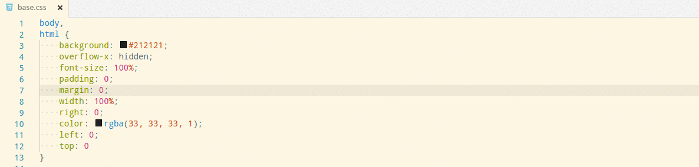
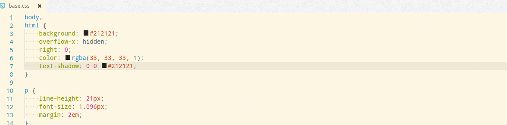
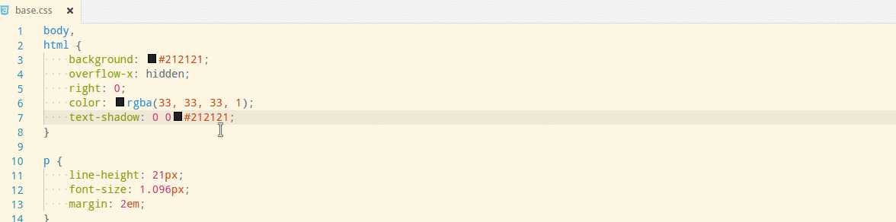
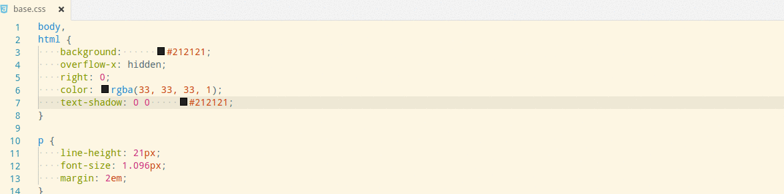
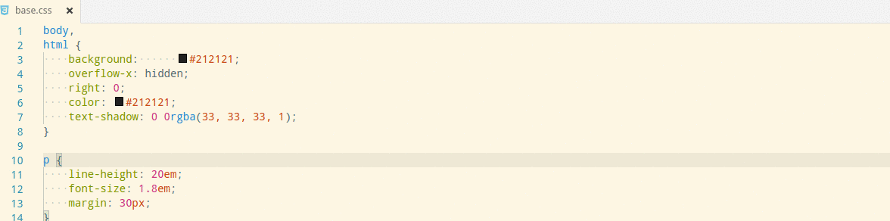

# What's brings this extension:

## Just the rights units
Unit converter will work like this:
 
* From: **px** to **em** and **em** to **px**
* From: **Hex** ('#') to **rgb | rgba** and **rgb | rgba** to **Hex**

>**Important:** Don't remove the unit from the text you are setting into the input bar or you are selecting. It's important to know from which unit are you going to convert.

The extension will work too with colours names such as **black**, **white**, **aquamarine**, **yellowgreen** and so on; converting all of them to their hexadecimal value

 

## How to
* **Setting the value**

To use **Unit Converter** you have to press down `F1` and type `unit converter`.
You will get a list of units (**px, em, #, rgb, rgba**). Then, it will appear an input box where you have to type or set the value to convert.
Finally, you will get a promptt with the new value.

* **Selecting the value(s) from the text editor**
    There are several ways to select and convert one or more values. To make any of this way to work, you must select the `unit + value`

    * **One value**
    
    
    * **Same values (two or more)**
    

    * **Differents Values (Two or more)**
    

    * **From a range of selected text**
    